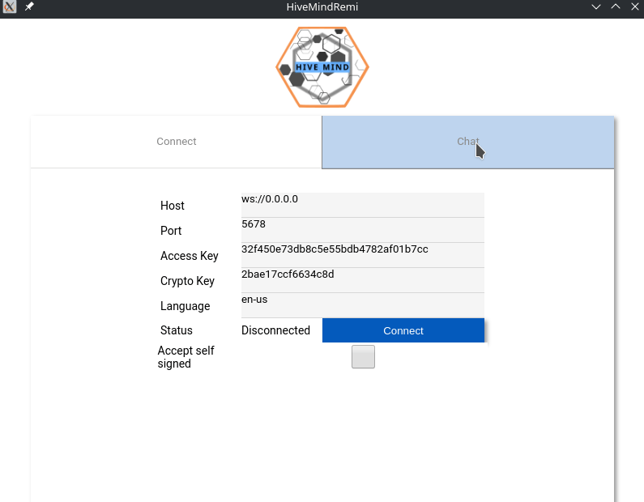

# HiveMind Remi

A small web GUI for testing connections to a
[hivemind-core](https://github.com/JarbasHiveMind/HiveMind-core) server. It is
built with the [Remi](https://github.com/rawpython/remi) framework, so the
interface is a local web page driven entirely by Python: fill in your server
credentials, connect, and chat with your assistant from the browser.



## Where it sits

HiveMind is a mesh: satellite devices connect to a central
[hivemind-core](https://github.com/JarbasHiveMind/HiveMind-core) server over an
authenticated, encrypted protocol. Remi is a throwaway **test satellite** — it
wraps the Python
[hivemind-bus-client](https://github.com/JarbasHiveMind/hivemind-websocket-client)
in a GUI so you can verify a server and access key work, and watch utterances
and spoken replies flow, without writing any code.

```
Remi web GUI (hivemind-bus-client)  ──encrypted──►  hivemind-core  ──►  OVOS / agent
```

## Install

```bash
pip install hivemind-remi
```

Or from source:

```bash
git clone https://github.com/JarbasHiveMind/HiveMind-remi
cd HiveMind-remi
pip install .
```

Runtime dependencies (`remi`, `hivemind-bus-client`, `ovos-bus-client`,
`ovos-utils`) are declared in `pyproject.toml` — it is the single source of
truth for packaging. See [docs/dependencies.md](./docs/dependencies.md) for the
version policy.

## Quickstart

### 1. Run a server and issue an access key

On the machine hosting the assistant, install and run
[hivemind-core](https://github.com/JarbasHiveMind/HiveMind-core):

```bash
hivemind-core add-client      # prints an access key + crypto/password key
hivemind-core listen --port 5678
```

### 2. Launch Remi

```bash
HiveMind-remi
```

Remi serves its GUI as a local web page and opens it in your browser.

### 3. Connect and chat

On the **Connect** tab, fill in:

| Field | Value |
|-------|-------|
| Host | the server address, e.g. `ws://127.0.0.1` (use `wss://` for TLS) |
| Port | the server's HiveMind port (default `5678`) |
| Access Key | the key from `hivemind-core add-client` |
| Password / Crypto Key | the password / crypto key for that client |
| Language | the utterance language tag (default `en-us`) |
| Accept self signed | tick if the server uses a self-signed TLS cert |

Click **Connect**. When the status reads *Connected to HiveMind!*, switch to the
**Chat** tab, type a message, and press **Send**. The assistant's spoken
responses appear in the chat log.

## Documentation

Full docs live in [`docs/`](./docs):

- [Installation](./docs/installation.md)
- [Configuration](./docs/configuration.md) — the Connect-tab fields explained
- [Architecture](./docs/architecture.md) — the remi web-GUI design and how it
  talks to hivemind-core
- [Dependencies](./docs/dependencies.md) — version policy and the 2.x stack
- [Running tests](./docs/testing.md) — smoke + HiveMind-side end-to-end suite

## License

Apache 2.0 — see [LICENSE](./LICENSE).
